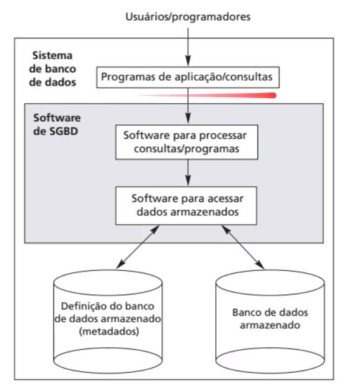
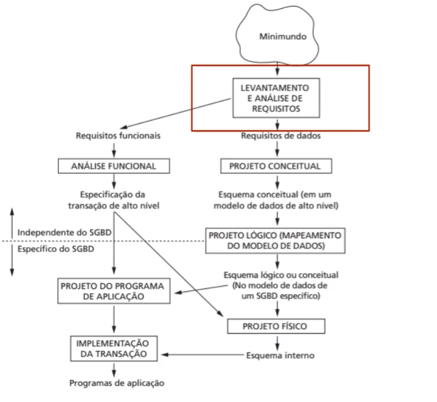
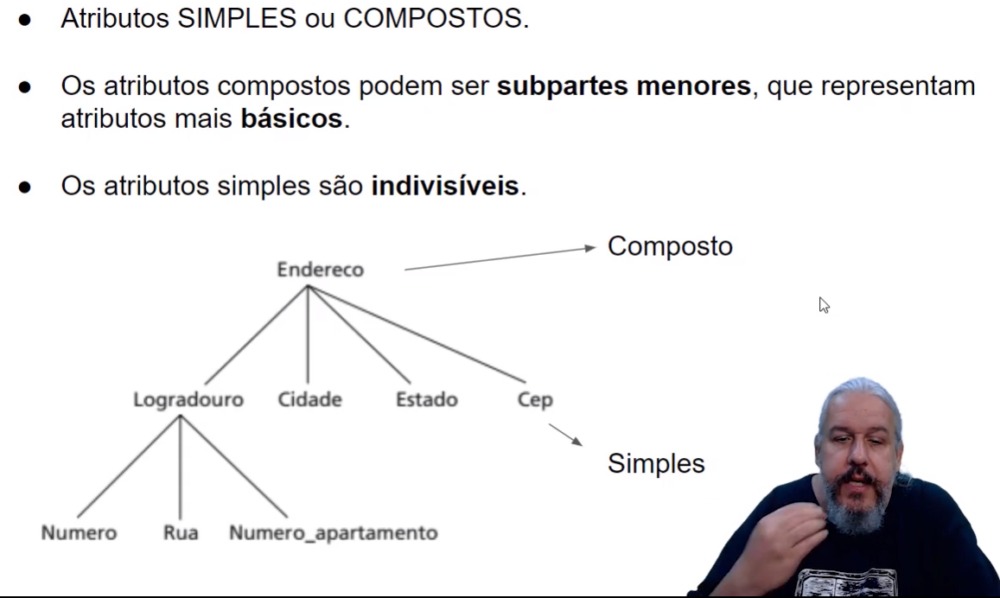

# DataBase
A relational database is used everyday by the most people   
A NoSQL database is used into facebook and others enterprises like twitter in the BIGDATA and data science.   
A database can have huge storage, it's not fixed. That's why there are DBMS (Database Management System) such as MySQL, Oracle, etc. These software allow you to define, insert, delete and consult the data.
## DBMS
* Definition - Specify types, structures and restrictions of stored data (Metadata).
* Construction - Process of storing data in some medium(meio).
* Handling - Query functions, retrieve data, update data and delete data.
* Sharing - Allow users and programs to access the database simultaneously.

## Entity
Entity is something or someone that represents something in real life  
Every entity has simple or compound attributes
 