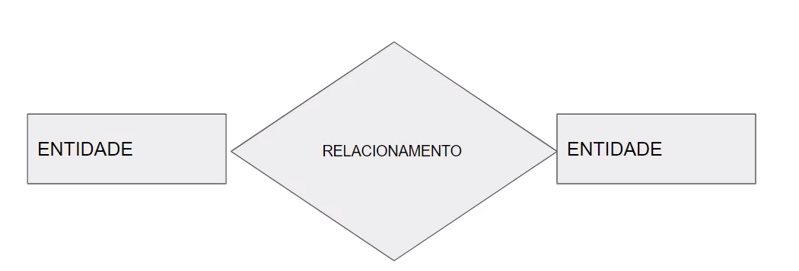

# DataBase
A relational database is used everyday by the most people   
A NoSQL database is used into facebook and others enterprises like twitter in the BIGDATA and data science.   
A database can have huge storage, it's not fixed. That's why there are DBMS (Database Management System) such as MySQL, Oracle, etc. These software allow you to define, insert, delete and consult the data.
## DBMS
* Definition - Specify types, structures and restrictions of stored data (Metadata).
* Construction - Process of storing data in some medium(meio).
* Handling - Query functions, retrieve data, update data and delete data.
* Sharing - Allow users and programs to access the database simultaneously.  

  
## Entity
Entity is something or someone that represents something in real life  
Every entity has simple or compound attributes  
  
 

  
### **Um atributo chave é um atributo único para cada entidade, EX: Não é possível ter 2 carros com o mesmo registro**
A combinação do estado e do número formam um único registro para cada carro exclusivamente
  
The relationship between 2 entities is represented by a diamond

Recursive relationship 

Cardinalidade tem haver com por exemplo quantos funcionários podem trabalhar para um departamento, aí a cardinalidade é definida em razões: 1:N, N:1, 1:1, N:M. Onde o N no exemplo seria o funcionário e M representa o departamento.

A cardinalidade mínima é quando uma entidade depende da outra para existir naquele mini-mundo, exemplo: Em uma empresa onde todo funcionário precisa estar em um departamento, o funcionário só existe caso esteja vinculado a algum departamento e o departamento só existe se houver funcionários nele.  
  
Quando a linha é dupla significa que a cardinalidade é total, pois uma entidade não existe sem a outra.  

Uma cardinalidade é parcial quando uma entidade não depende da outra para existir. No exemplo o funcionário não necessita do projeto para existir, no entanto o projeto precisa de funcionário gerente para existir.
  
Aí está uma outra maneira de ilustrar as mesmas relações de cardinalidade apresentadas acima. Perceba que entre parênteses quando o primeiro número é 0 significa que a cardinalidade é parcial, ou seja, não precisa da outra entidade para existir, mas perceba também que não é algo mútuo, pois a outra entidade tem como o primeiro número o 1 e por isso a cardinalidade é total, logo necessita da outra entidade para existir.  
Essa forma de ilustrar é melhor e mais utilizada.
  

Em relacionamentos N:M não é possível migrar.  

A relação entre entidades fracas e fortes é feita por um losango duplo.  
Com isso sublinhamos com pontilhado o atributo que faz essa relação ser única.
  
  
