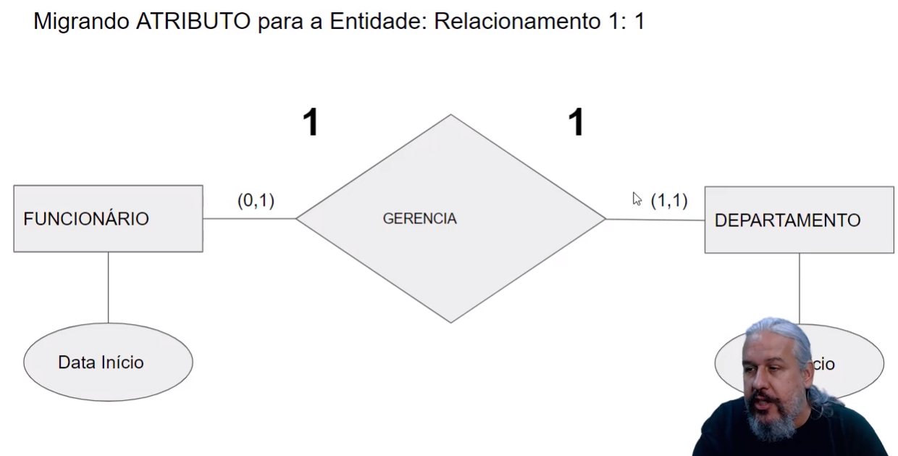
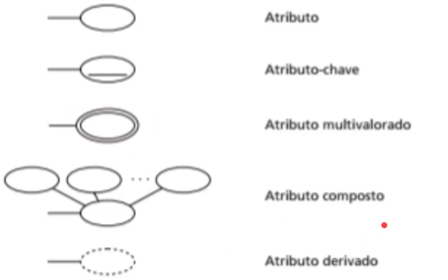

# DataBase

A relational database is used everyday by the most people  
A NoSQL database is used into facebook and others enterprises like twitter in the BIGDATA and data science.  
A database can have huge storage, it's not fixed. That's why there are DBMS (Database Management System) such as MySQL, Oracle, etc. These software allow you to define, insert, delete and consult the data.

## DBMS

- Definition - Specify types, structures and restrictions of stored data (Metadata).
- Construction - Process of storing data in some medium(meio).
- Handling - Query functions, retrieve data, update data and delete data.
- Sharing - Allow users and programs to access the database simultaneously.  
  
  

## Entity

Entity is something or someone that represents something in real life  
Every entity has simple or compound attributes  
  

### **Um atributo chave é um atributo único para cada entidade, EX: Não é possível ter 2 carros com o mesmo registro**

A combinação do estado e do número formam um único registro para cada carro exclusivamente
  
The relationship between 2 entities is represented by a diamond

Recursive relationship

Cardinalidade tem haver com por exemplo quantos funcionários podem trabalhar para um departamento, aí a cardinalidade é definida em razões: 1:N, N:1, 1:1, N:M. Onde o N no exemplo seria o funcionário e M representa o departamento.

A cardinalidade mínima é quando uma entidade depende da outra para existir naquele mini-mundo, exemplo: Em uma empresa onde todo funcionário precisa estar em um departamento, o funcionário só existe caso esteja vinculado a algum departamento e o departamento só existe se houver funcionários nele.  
  
Quando a linha é dupla significa que a cardinalidade é total, pois uma entidade não existe sem a outra.  

Uma cardinalidade é parcial quando uma entidade não depende da outra para existir. No exemplo o funcionário não necessita do projeto para existir, no entanto o projeto precisa de funcionário gerente para existir.
  
Aí está uma outra maneira de ilustrar as mesmas relações de cardinalidade apresentadas acima. Perceba que entre parênteses quando o primeiro número é 0 significa que a cardinalidade é parcial, ou seja, não precisa da outra entidade para existir, mas perceba também que não é algo mútuo, pois a outra entidade tem como o primeiro número o 1 e por isso a cardinalidade é total, logo necessita da outra entidade para existir.  
Essa forma de ilustrar é melhor e mais utilizada.
  

Em relacionamentos N:M não é possível migrar.  

A relação entre entidades fracas e fortes é feita por um losango duplo.  
Com isso sublinhamos com pontilhado o atributo que faz essa relação ser única.
  

## Normalização

A normalização é a técnica de transformar um conjunto de dados em um conjunto de dados normalizados.  
Normalização é aplicada aos dados de entrada para que possam ser processados por um algoritmo.  
A normalização preza por prevenir de anomalias de inclusão, exclusão e modificação.  
As anomalias de inclusão acontecem quando um dado é incluso e pode causar problemas no banco.  
As anomalias de exclusão acontecem quando um dado é excluído e pode causar problemas no banco.  
As anomalias de modificação acontecem quando um dado é modificado e pode causar problemas no banco.
Ex: não deve ser possível cadastrar um livro sem um autor, portanto se o autor for removido, o livro também deve ser removido, se o autor for alterado, o nome do autor do livro também deve ser alterado.  
Caso não esteja de acordo com o exemplo acima, o banco de dados pode ser inconsistente.  
Para resolver esses problemas, é necessário aplicar a normalização.

### Aplicando a normalização

A normalização é composta por 3 partes:

- **Preparação** - Preparação é a parte de preparar os dados para que possam ser normalizados.
- **Normalização** - Normalização é a parte de normalizar os dados.
- **Análise** - Análise é a parte de analisar os dados normalizados.
  Para isso temos as formas normais que devem ser colocadas em prática na modelagem do banco de dados:
- **Primeira Forma** - Primeira forma é a forma mais simples, onde o banco de dados é criado com as tabelas e os atributos, tal que não deve existir atributos multivalorados, duplicados, compostos e tabelas dentro de tabelas.  
  Ex: Em uma tabela de clientes temos o atributo nome, que é um atributo único, e o atributo cpf, que é único, temos também o atributo endereço, que é um atributo composto, que tem o atributo rua, que é um atributo único, e o atributo bairro, que é um atributo único e tem o ID do cliente que é o atributo chave.  
  Aplicando a primeira forma normal iremos separar os atributos em tabelas, onde cada tabela terá um atributo único.  
  O endereço agora será uma tabela separada contendo os atributos únicos e será identificada pelo ID do cliente.
- **Segunda Forma** - Segunda forma é a forma que fala que os atributos em uma tabela devem ser totalmente dependentes da chave primária sendo ela composta ou não.  
    
  
- **Terceira Forma**  
    
    
    
  

## ORM (Object-Relational Mapping)

ORM é uma abreviação de Object-Relational Mapping, que significa mapeamento de objetos relacionais.  
É uma maneira de tratar o banco de dados como um objeto, ou seja, como um objeto de domínio, com isso podemos mexer objeto ORM para manipular o banco de dados.  
Uma das formas de utilizar o ORM é por exemplo o mongoose, que é um ORM para o mongoDB.  
O typeORM é uma outra forma de utilizar o ORM, que é um ORM para a linguagem SQL.  
Para utilizar o TYPEORM precisamos instalar ele na nossa aplicação com yarn add typeorm --save e depois precisaremos instalar o reflect-metadata para podermos utilizar o typeorm com yarn add reflect-metadata --save.  
Após isso iremos instalar o driver o banco que iremos utilizar como MySql, yarn add mysql2 --save ou PostgreSQL, yarn add pg --save.
