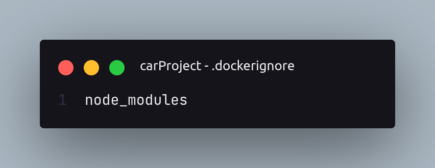
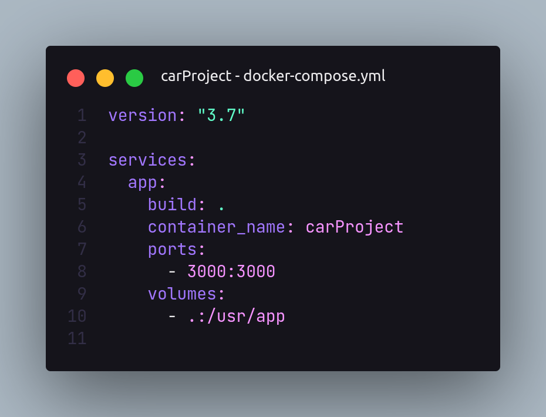

# Docker
## O que é o docker?
O Docker é uma ferramenta de criação de containers.  
### Mas o que é um container?
Container é um ambiente isolado dentro da nossa máquina.  
Com o container temos as nossas imagens que são instruções para criação de um container  

O Docker veio para resolver o famoso problema: Ahh na minha máquina funciona!!  
Ou seja, o Docker basicamente faz com que o que roda localmente também rode em produção  
O Docker permite que usemos o mesmo SO dentre os containers, portanto podemos usar os mesmos recursos que a máquina host   
  
## Aplicando o Docker
Podemo rodar nossa aplicação dentro do Docker, é bom rodarmos na nossa máquina, mas com o Docker não precisamos de muita coisa instalada para rodar a aplicação, portanto qualquer máquina pode rodar.  
Para rodar nossa aplicação dentro do Docker, iremos criar um Dockerfile na raiz do nosso projeto e dentro dele terá todo o nosso passo a passo que precisamos para rodar o nosso projeto.  
Na primeira linha iremos passar a imagem que iremos passar para esse container, no nosso caso é a imagem do node.  
O nosso código está assim:  
  
Apenas troque a linha 3 a parte do ./usr/app por ./
- A primeira linha de código está relacionada a imagem que iremos passar para o container,   
- A segunda linha tem o WORKDIR que representa a pasta em que serão armazenadas as informações assim que o docker rodar o programa.
- Logo apoś vem o comando COPY que estará copiando o arquivi package.json para o nosso diretório de trabalho do docker
- Após copiar o arquivo para dentro do diretório, iremos instalar as dependências do package.json no diretório
- Na 4 linha mandamos ele copiar tudo do projeto, exceto os itens ignorados pelo dockerignore, para dentro do diretório.
- Agora com o EXPOSE iremos expor a porta que estamos utilizando dentro do nosso container
- E por fim iremos passar o cmd para rodar o script, por padrão é separado dentro de array, então iremos passar o npm com o comando pra rodar(run) e o dev que é o mesmo que yarn dev que utilizamos sempre

Esse é o nosso dockerignore:  
  
Agora iremos criar a nossa imagem com o docker build -t nomedaimagem .  
O ponto é para dizer onde está o nosso dockerfile, no caso está na raiz do projeto  
Vamos ver agora os containers que estã rodando com o docker ps, porém não aparece o container que criamos, pois precisamos agora rodar ele de fato, nós apenas criamos ele com o build.  
Para rodar iremos utilizar o comando:

```console
docker run -p 3000:3000 carprjt
```

carprjt é o nome do nosso container  
Docker run -p(para mapear as portas) 3000:3000(quer dizer que toda vez que no localhost, for chamada a porta 3000, queremos que dentro do docker ele procure pela porta 3000 que é a porta do nosso container) carprjt.  
Para confirmar que estamos realmente utilizando o docker podemos o comando docker ps e pegar o nome do container ou o id, com o nome ou o id podemos verificar se está rodando realmente com o comando:

mystifying_bhabha é o nome do nosso container que foi dado pelo docker

```console
docker exec -it mystifying_bhabha /bin/bash
```

Com isso iremos ter acesso ao terminal do nosso container, se quisermos verificar os nossos arquivos podemos digitar ls e iremos ver no terminal.

## Docker-compose
O Docker-compose é um orquestrador de container  
Para colocar em prática o docker compose iremos criar um arquivo docker-compose.yml  
Lembrando que na instalação do docker já instalamos também o docker-compose, para linux é necessário instalar separado, já para windows e mac quando se instala o docker já se instala também o docker-compose  

**Até agora tinhamos 2 problemas, precisávamos escrever docker kill nomeDoContainer para parar o docker e o docker não atualizava junto com a nossa aplicação.  
O Docker-compose resolve esses nossos problemas!!!**  
Precisamos somente digitar docker-compose up no terminal para rodar a aplicação no docker e se quisermos parar basta apertar ctrl+c no terminal.  
Caso queiramos que ele funcione no background, basta digitar docker-compose up -d  
Para verificar se está funcionando basta digitar docker logs nomeDoContainer  -f  
  
A versão é a versão que está disponível para nós no momento, os serviços são de fato todos os serviços que utilizaremos na nossa aplicação, então iremos colocar todos dentro dele, por enquanto temos apenas o nosso app que contém a nossa aplicação, mas ainda vamos adicionar o banco de dados que iremos utilizar, a nossa build é toda a nossa aplicação por isso contém o ponto, as portas estão a porta do host e do docker e os volumes primeiramente tem o . que significa toda nossa aplicação exceto o dockerignore e o que está dentro dele e o (:) significa passar para no caso para o diretório, então se lê: passar tudo dessa pasta para o diretório tal