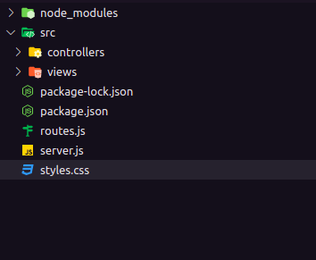
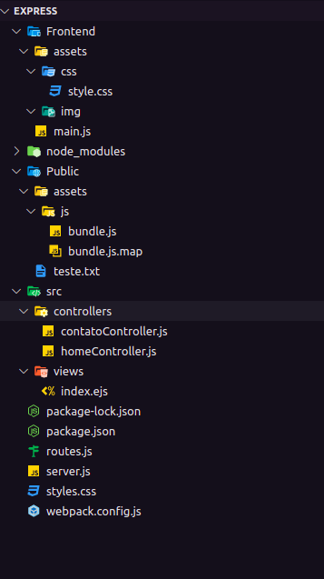
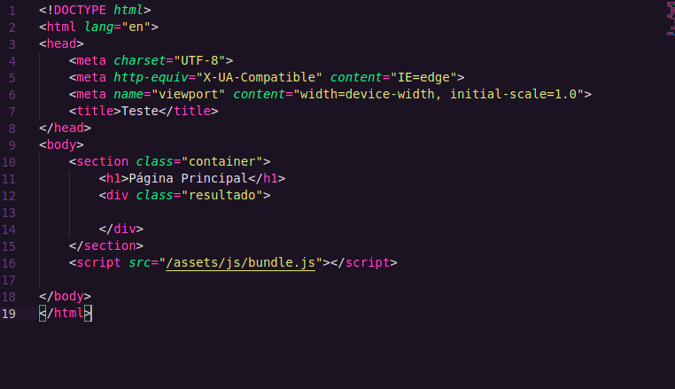
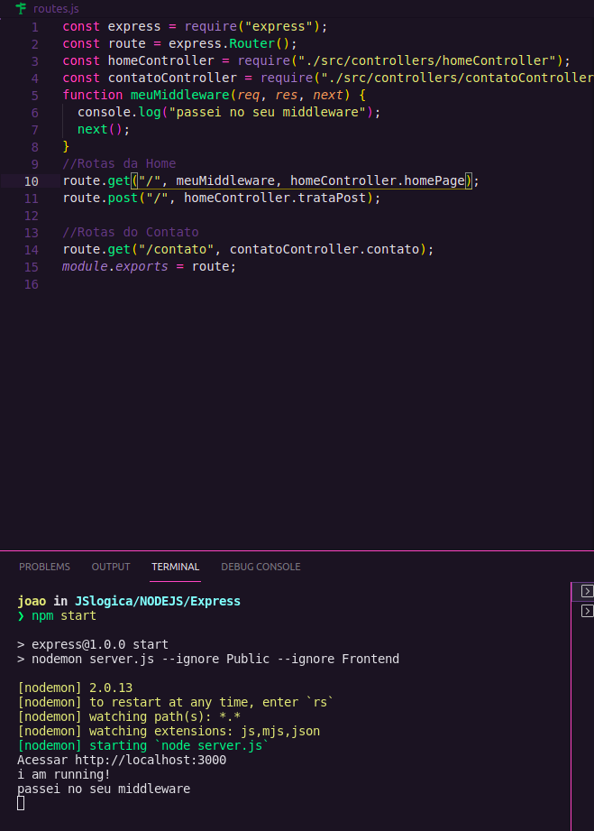
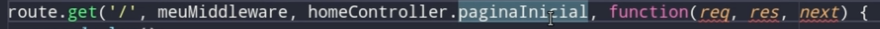

# Express with node

For development better use linux, as the vast majority of servers are linux servers
## Nodemon
To start nodemon in package.json scripts let's add start and put nodemon server.js
To start the server we will use npm start
## Express introduction
Import express into the project, it's a node package so use require   
By convention create a variable called app   
Application routes are associations between an http method, a url, and a controller method   

```
Ex: method:'GET', url:'url', action:'listusers()'
```

If we have the site http://mysite.com/, the route gets the page /   
If we have the site http://mysite.com/sobre, the route gets the page /sobre      
CRUD - CREATE READ UPDATE DELETE   
Basic API Operations:   
CREATE->> POST, READ->> GET, UPDATE->> PUT, DELETE->>DELETE      
The first parameter of get is the route, in this case the initial /   
The second parameter receives the request and the response (req,res) by default   
The request (require) is what the user is asking for and the response is what will be sent   
```js
app.get('/route',(req,res)=>{
    res.send('something')
})
```
The internet works in request/response mode   
The client sends the request and the server has to send the response   
To send a very basic answer we will send a hello world   
```js
res.send("Hello world"); 
```
Let's send an HTML form to the server   
For this we will use template strings ``   
The post is usually used to receive (create) items from the customer   

```js
app.get("/", (req, res) => {
  res.send(`<form action="/" method="POST">
  Nome: <input type="text" name="nome">
  <button>Enviar formulário</button>
  </form>`);
});
app.post("/", (req, res) => {
  res.send("Recebi o formulário");
});
```
For example uploading files or forms   
In order to receive the form, the post is extremely necessary, without it it would give the error that it cannot be received without the post   
However, it is necessary to ask the server to listen for any request that arrives at the port   
A port refers to a process running on the server   
Some ports have standard things running on them, so we usually use ports that are not as common as 3000 or 3333   
To ask the express to listen use the method listen   
The first parameter is the port   
The second parameter we will pass here a console.log to show that the server is running   
The localhost or 127.0.0.1 is in reference to our machine   

```js
app.listen(3000, () => {
  console.log("Acessar http://localhost:3000");
  console.log("i am running!");
});
```

It is better to start the server by the node server.js method as it is easier to stop it just by typing Ctrl+C   
With each change it is necessary to stop the server and run again, but this is not very productive   
Nodemon restarts the server automatically   
#### Routes
Routes also have parameters   
For example http://mysite.com/profiles/5 the profiles route has for itself the parameter 5  
http://site.com/rota/parametro?querystring   
THE ? serves to demonstrate that it is a query string  
The & serves to separate a query string from another   

## Req params
Request parameters are accessed by req.params   
To access a parameter, it must be passed in the get method  
To say that is a param you need to put the : after the /

```js
app.get("/testes/:id_profiles", (req, res) => {
  console.log(req.params);
});
```

```js
Output:
Ex:"/testes/profiles"
{id_profiles: 'profile'}
```
Let's make the parameters optional with:

```js
"/testes/:id_profiles?"
```

The ? is the symbol for optional

## Req query
To access the require query we use req.query  

```js
app.get("/testes/:id_profiles?", (req, res) => {
  console.log(req.query);
  res.send(req.query);
});

```
## Req Body
To access the require body we use req.body  
The POST will appear in the body of the request  
If we put a console log for req.body in get will appear undefined

```js
app.get("/testes/:id_profiles?", (req, res) => {
  console.log(req.body);
});
Output: Undefined
```

The right way is:

```js

app.post("/", (req, res) => {
  console.log(req.body)
});
```
However, express by default returns us undefined as it doesn't handle  
So we have to tell it to handle req.body

```js
app.use(express.urlencoded({extended:true}))

```

And now will appear the input in the console  
To send that:

```js
app.post("/", (req, res) => {
  res.send(`Você me enviou ${req.body.nome}`);
});
```

Remember:

```js
<form action="/" method="POST">
  Nome: <input type="text" name="nome">
  <button>Enviar formulário</button>
  </form>
```

# MVC AND EXPRESS

## Controllers
We will use a folder only for routes and we will use the MVC pattern  
We are going to create a routes.js file and we are going to put our routes in it.  
```js
Router.js
const express = require("express");
const route = express.Router();

```

Let's move our routes to the routes.js 

```js
const express = require("express");
const route = express.Router();

route.get("/", (req, res) => {
  res.send(`<form action="/" method="POST">
  Nome: <input type="text" name="nome">
  <button>Enviar formulário</button>
  </form>`);
});

```

But the functions of our routes will be stored by the controllers, so we will create the controllers folder  
We will create a controller for each feature eg a controller for the home page, a controller for creating users, etc  

```js
Controllers/homeController.js
exports.homePage = (req, res) => {
  res.send(`<form action="/" method="POST">
  Nome: <input type="text" name="nome">
  <button>Enviar formulário</button>
  </form>`);
};

```

Our file routes.js
```js

const express = require("express");
const route = express.Router();
const homeController = require("./controllers/homeController");
route.get("/", homeController.homePage);
//This is not homePage() is homePage
module.exports = route;

```
Our file server.js
```js
const express = require("express");
const app = express();
const routes = require("./routes");
app.use(express.urlencoded({ extended: true }));
app.use(routes);
app.listen(3000, () => {
  console.log("Acessar http://localhost:3000");
  console.log("i am running!");
});
```

We need to say to the express to use our routes with:

```js
app.use(routes);
```

Now we will create a post route:

```js
routes.js
const express = require("express");
const route = express.Router();
const homeController = require("./controllers/homeController.js");
//Rotas da Home
route.get("/", homeController.homePage);
route.post("/", homeController.trataPost);

module.exports = route;

```

```js
homeController.js
exports.homePage = (req, res) => {
  res.send(`<form action="/" method="POST">
  Nome: <input type="text" name="nome">
  <button>Enviar formulário</button>
  </form>`);
};
exports.trataPost = (req, res) => {
  res.send("Ei sou sua nova rota de post");
};

```

Now we will gonna create the contact routes
```js
contatoController.js
exports.contato = (req, res) => {
  res.send("Bem vindo a sua rota de contato");
};
```

```js
Routes.js
... código anterior
//Rotas do Contato
route.get("/contato", contatoController.contato);
module.exports = route;
```
Our server.js stay the same  
## Views 
At now our project have back-end and front-end together, but we will gonna create folders for back and front end  
We will create a folder src for the backend and will move the controllers for the src folder  
Now we will create a folder for the Views   
At now our project is like:  
  
We need to tell express that we are going to use the views folder as views and what engine will it use to render the views  
To do that:
```js
server.js
...
const path = require("path");
app.use(express.urlencoded({ extended: true }));
app.set("views", path.resolve(__dirname, "src", "views"));
app.set("view engine", "ejs");
...
```
Let's pass as a parameter that we want to set the views and after that we'll pass the folder path  
Let's pass a second set function to say the view engine, we gonna use the ejs engine to render our views because its similar to the HTML 
<br> 
<br> 
We need to use these engines to render because we need to use operators like for, if and others and we know that pure HTML doesn't do that  
For do that we need to install the ejs engine in the terminal: 

```sh
npm i ejs
```

Now we will create a index.ejs in the views folder to render the views
```html
index.ejs

<!DOCTYPE html>
<html lang="en">
<head>
    <meta charset="UTF-8">
    <meta http-equiv="X-UA-Compatible" content="IE=edge">
    <meta name="viewport" content="width=device-width, initial-scale=1.0">
    <title>Testes</title>
</head>
<body>
    <h1>Eu fui renderizado</h1>
</body>
</html>
```

And in the controllers/homeController we will render ouw view that:
```js
exports.homePage = (req, res) => {
  res.render("index");
};
exports.trataPost = (req, res) => {
  res.send("Ei sou sua nova rota de post");
};

```
## Static content vs Dinamic content
Now let's create a folder for our application's static content, the static content is for example the bundle.js that will be loaded by our application. Static content is content that does not change with user interaction(video is static), it is always the same. Dynamic content is content that responds to user interaction. Sites that contain pure HTML and CSS are considered static, to be considered must have scripts.  
The folder name's Public  
And in the server.js we wil put that:

```js
app.use(express.static(path.resolve(__dirname, "Public")));
```

Now we wil create any file in the Public folder to test:

```txt
Alguma coisa
```

In the url let's put http://localhost:3000/teste.txt to see the text file  
## Express with Webpack
### **Briefly, what's in the frontend folder goes to the browser, what's in the src folder goes to the terminal.**
We will gonna create now a folder with the name Frontend and the folder src will stay with the backend  
Now let's copy the webpackconfig and our front end model  
  
Important points: In the server.js file we are saying that our static files are in the Public folder, in our index.ejs it is referring to this folder and it is not necessary to reference the /Public only the /assets/js/bundle.js  
  
We brought the settings from our webpackmodel, then we added the assets from the static files and from our frontend folder, some things were with the wrong path but we've already configured
## Middlewares
In our route.metodo('/',middleware) every parameter after the route itself is middleware, which could be a function in the middle of the path or at the end of answering the client

```javascript
route.get('/',middleware)
```

Our homeController have 2 middlewares

```javascript
exports.homePage = (req, res) => {
  res.render("index");
};
exports.trataPost = (req, res) => {
  res.send("Ei sou sua nova rota de post");
};

```





### Sessions are used to save temporary data like login and password when the client is logged

To use session we can put req.session, like:

```js
function meuMiddleware(req, res, next) {
  req.session = {
    nome: "Luiz",
    sobrenome: "Miranda",
  };
  console.log("passei no seu middleware");
  next();
}
```
We can do that with homeController.js

```javascript
exports.homePage = (req, res) => {
  res.render("index");
  console.log(`Bem vindo cliente ${req.session.nome} ${req.session.sobrenome}`);
};
exports.trataPost = (req, res) => {
  res.send("Ei sou sua nova rota de post");
};
```

And do that with the route.get('/')

```javascript
route.get("/", meuMiddleware, homeController.homePage);
```

Now we will use the middlewares in our server.js with all the routes, like:
```javascript
app.use(meuMiddleware);
```

We can only send a message if the form you want has the proper name.

```javascript
const meuMiddleware = (req, res, next) => {
  if (req.body.cliente) {
    console.log();
    console.log(`Vi que você postou ${req.body.cliente}`);
    console.log();
  }
  next();
};
```

In the index.ejs 

```html
  <form action="/" method="post">
            <label >Cliente</label>
            <input type="text" name="cliente">
            <button>submit</button>
        </form>
```

But if we only want the first name, we can do:

```javascript
if (req.body.cliente) {
    var primeiroNome = req.body.cliente.split(" ");
    console.log();
    console.log(`Vi que você postou ${primeiroNome[0]}`);
    console.log();
  }
  input: João Pedro
  output: Vi que você postou João
```