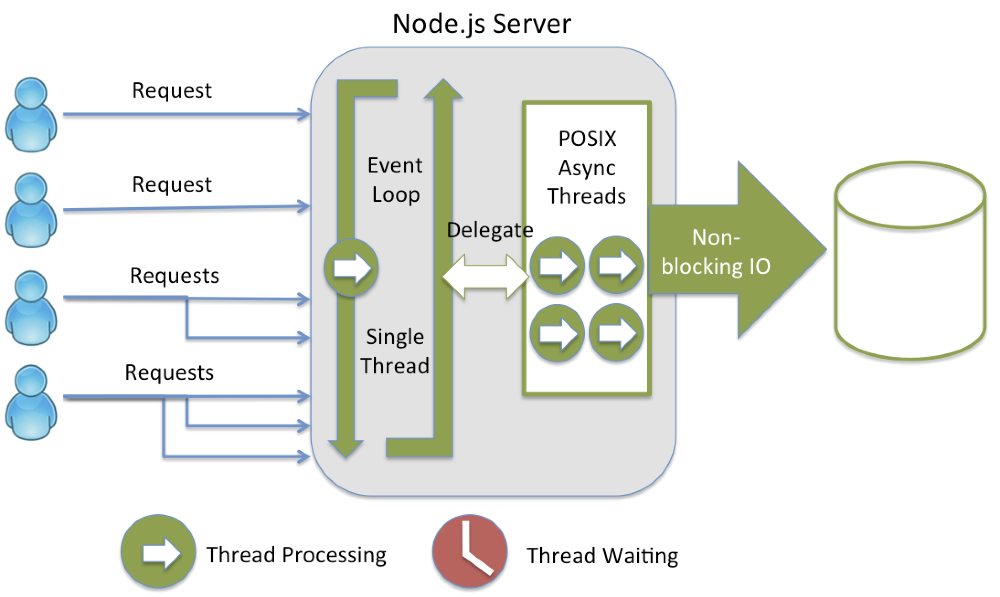

# NodeJS
## What is the Node.JS?
É uma plataforma open source que permite a execução do javascript do lado do servidor(backend)  
É composto pelo V8(criado pelo google) que é um processador e interpretador para o js na web, com a libuv e um conjunto de módulos.  
O Node.JS veio resolver o problema que as tecnologias da época que foi criado não dava um bom suporto para I/O assincrono(input/output)  
## Características
- Arquitetura Event Loop
- - Call stack(pilha de funções que serão chamadas)  
- Single-Thread(Veremos a seguir como ele resolverá o problema de i/o assincrono)
- Non-blocking I/O(Não necessita que para uma função ser executada, a função anterior tenha sido finalizada)
- Módulos Próprios(http,DNS,filesystem,buffer,...)  
O event loop é single thread, mas o node em si tem por padrão 4 threads e quando chega alguma requisição na call stack, o event loop pega a requisição e manda para alguma das 4 threads

## Gerenciadores de pacotes
- NPM e Yarn
- - Vem com os pacotes padrões instalados e podem instalar novos pacotes
- - Podem disponibilizar bibliotecas 
- O yarn é um pouco mais rápido portanto iremos utilizá-lo
## Frameworks
- Express
- Egg.js
- Nest.js
- Adonis.js
- Entre outros
