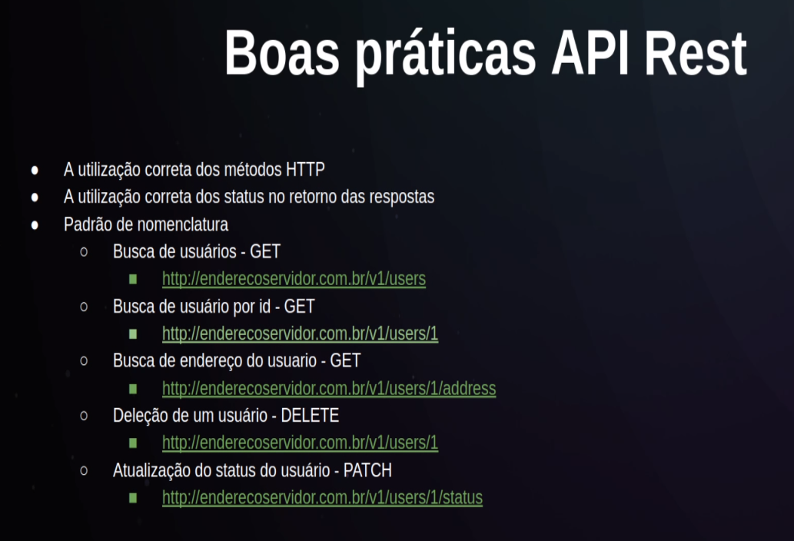

# NodeJS
## What is the Node.JS?
É uma plataforma open source que permite a execução do javascript do lado do servidor(backend)  
É composto pelo V8(criado pelo google) que é um processador e interpretador para o js na web, com a libuv e um conjunto de módulos.  
O Node.JS veio resolver o problema que as tecnologias da época que foi criado não dava um bom suporto para I/O assincrono(input/output)  
## Características
- Arquitetura Event Loop
- - Call stack(pilha de funções que serão chamadas)  
- Single-Thread(Veremos a seguir como ele resolverá o problema de i/o assincrono)
- Non-blocking I/O(Não necessita que para uma função ser executada, a função anterior tenha sido finalizada)
- Módulos Próprios(http,DNS,filesystem,buffer,...)  
O event loop é single thread, mas o node em si tem por padrão 4 threads e quando chega alguma requisição na call stack, o event loop pega a requisição e manda para alguma das 4 threads

## Gerenciadores de pacotes
- NPM e Yarn
- - Vem com os pacotes padrões instalados e podem instalar novos pacotes
- - Podem disponibilizar bibliotecas 
- O yarn é um pouco mais rápido portanto iremos utilizá-lo
## Frameworks
- Express
- Egg.js
- Nest.js
- Adonis.js
- Entre outros
# API
- Application Programming Interface(Interface de Programação de aplicativos)
- Conjunto de especificações de possíveis interações entre aplicações
- Documentação para o desenvolvedor
## REST
- Representation State Transfer(Transferência Representacional de Estado)
- Modelo de arquitetura
- - Portanto se fizermos nossa API com base no modelo REST, nossa API será uma API REST
### Regras REST
Para ser uma API REST é necessário que a API siga 6 regras:
1. Client-Server
- - De um lado tem o servidor e do outro o cliente
- - Ou seja o cliente não precisa se preocupar com o que acontece do lado do servidor e vice-versa
- - No geral o cliente é o front-end e o servidor é o back-end, mas existem casos em que um back-end consome uma API e portanto temos o Client-Server de 2 back-end
2. Stateless 
- - A API precisa ser stateless
- - Ou seja o cliente pode fazer quantas requisições quiser, mas o servidor não armazena informações sobre as requisições(assim como o HTTP) e por isso as requisições sempre precisarão passar todas as informações necessárias
3. Cache
4. Interface Uniforme
- - Identificação dos recursos
- - Exemplo: http://enderecoservidor.com.br/products -- Para informar que estamos tratandos de produtos
- - Exemplo: http://enderecoservidor.com.br/clients -- Para informar que estamos tratandos de clientes
- - Representação dos recursos(o servidor pode entregar recursos em várias formas, não necessariamente json)
- - Mensagens auto-descritivas
- - HATEOAS (Hypertext As The Engine Of Application State)Basicamente retornar links dentro da requisição
5. Camadas
6. Código Sob Demanda
# HTTP Verbs
**GET** - Leitura  
**POST** - Criação  
**PUT** - Atualização  
**DELETE** - Deletar  
**PATCH** - Atualização parcial
# HTTP Codes
**1XX** - A solicitação foi aceita ou o processo continua em andamento(INFORMAÇÃO)  
**2XX** - Confirmação
- **200** -  Requisição bem sucedida
- **201** - Created - Geralmente usado para POST após uma inserção   

**3XX** -  Redirecionamento
- **301** - Moved Permanently
- **302** - Moved
  
**4XX** -  Erro do cliente
- **400** - Bad Request
- **401** - Unauthorized
- **403** - Forbidden
- **404** - Not Found
- **422** - Unprocessable Entity  
  
**5XX** - Erro do servidor 
- **500** - Internal Server Error
- **502** - Bad Gateway 

## Parâmetros das Requisições
- Header Params
- - Vão no cabeçalho como tokens e afins
- - https://app.rocketseat.com.br/node/ o node é o header params
- Query Params ou Query Strings
- - https://endereco.com.br/v1/user?page=2&limit=50
- - Chaves = page e limit / Valor = 2 e 50 / Separação = &
-  Route Params
-  - https://endereco.com.br/v1/user/{id} ex: req.params.id
- - Podemos passar receber id pelas rotas  
- Body Params
- - Parâmetros no corpo do json
## Boas Práticas API Rest
