# Aplicando o SOLID em uma aplicação Typescript
## Relembrando o SOLID
S => SRP => Princípio da responsabilidade única  
Uma classe só deve ter uma única função.  
O => OCP => Princípio Aberto-Fechado  
Uma classe ou função pode ser estendida porém não modificada  
L => LSP => Princípio da Substituição de Liskov
Uma classe que herda ou implementa outra classe deve poder ser substituída pela classe pai.  
I => ISP => Princípio de Segregação de Interfaces  
Uma classe não deve ser obrigada a implementar uma interface que contenha atributos ou métodos que a classe não irá utilizar  
OBS: Basicamente não deve-se criar interfaces muito grandes e genéricas.  
D => DIP => Princípio da Inversão de Dependência  
**Anda lado a lado com o LSP**  
Módulos de alto nível não devem depender de módulos de baixo nível.  
Módulos de alto nível: são as rotinas mais fáceis de entender, mais próximas da realidade de qualquer programador. Tendem a exigir menos carga mental para serem usadas;  
Módulos de baixo nível: são as rotinas mais complexas e difíceis de entender. Geralmente são compostas de implementações de cálculos ou comportamentos específicos.  
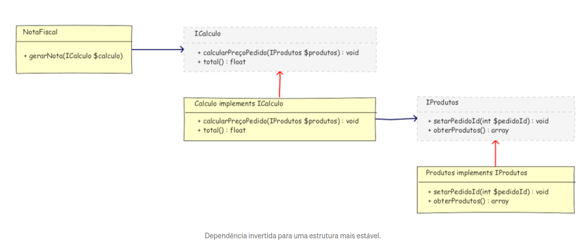
## Iniciando o projeto
Para iniciar o projeto iremos fazer todas as configurações que estão presentes no módulo de typescript do eslint, prettier e instalar o express com sua dependência para typescript.  
Agora então iremos criar o nosso server.ts, o nosso projeto se chamará carProject.  
Até então o nosso server.ts está assim:

```javascript
import express from "express";

import categoriesRoutes from "./routes/categories.routes";

const app = express();
app.use(express.json());
app.use(categoriesRoutes);
app.listen(3000, () => console.log("listening on 3000"));
```

Já está importando a nossa rota de categorias da nossa pasta de rotas.
## Situação atual do projeto
Atualmente o projeto está organizado assim:  
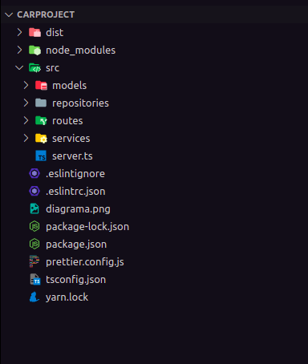  
A nossa pasta de models contém toda a modelagem, todo o schema da nossa aplicação. Lá tem como os nossos dados devem ser, ou seja, o modelo deles. Assim como o mongoose.Schema(), nela possui somente os atributos da nossa classe.  

A nossa pasta de repositórios possui todas as operações CRUDs da nossa classe que foi importada do model. Além dos repositórios, ela também possui as interfaces que serão implementadas pelas classes para manter o SOLID.  
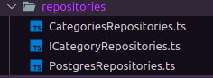  
Contém 2 repositórios diferente para mostrar como o princípio da substituição de Liskov, as 2 classes(Postgres e Categories) são filhas da interface e na hora de implementar basta passar a interface como parâmetro. 


A nossa pasta de service possui a execução de cada um dos comandos CRUD do repositório: 


Esse é um serviço para a execução do create, perceba:
```javascript
// Será responsável por criar uma categoria

import {
  ICategoryRepositories,
  ICategoryRepositoriesDTO,
} from "../repositories/ICategoryRepositories";

class CreateCategoryService {
  // Inversão de dependência, o private é necessário
  constructor(private category: ICategoryRepositories) {
    this.category = category;
  }

  execute({ name, description }: ICategoryRepositoriesDTO) {
    const categoryAlreadyExists = this.category.findByName(name);
    if (categoryAlreadyExists) {
      throw new Error("Category already exists");
    }
    const newCategory = this.category.create({ name, description });
    return newCategory;
  }
}

export default CreateCategoryService;
```

Essas são as funções que estão sendo importadas:

```javascript
import Category from "../models/CategoryModel";

interface ICategoryRepositoriesDTO {
  // A interface é responsável por definir os valores dos atributos
  name: string;
  description: string;
}

interface ICategoryRepositories {
  create({ name, description }: ICategoryRepositoriesDTO);

  findByName(name: string): Category | undefined;
  list(): Category[];
}
export { ICategoryRepositories, ICategoryRepositoriesDTO };

```

A nossa pasta de rotas contém atualmente somente a nossa rota de categoria:

```javascript
import { Router } from "express";

import CategoriesRepositories from "../repositories/CategoriesRepositories";
import { PostgresCategoryRepositories } from "../repositories/PostgresRepositories";
import CreateCategoryService from "../services/CreateCategoryService";

const categoriesRoutes = Router();
const categoryRepo = new CategoriesRepositories();
const category = new CreateCategoryService(categoryRepo);
// Não deixaremos a rota ter acesso ao banco de dados
categoriesRoutes.post("/categories", (req, res) => {
  try {
    const { name, description } = req.body;
    const newCategory = category.execute({ name, description });
    return res.status(201).json(newCategory);
  } catch (err) {
    return res.status(400).json({ error: err.message });
  }
});
categoriesRoutes.get("/categories", (req, res) => {
  try {
    const categories = categoryRepo.list();
    return res.status(200).json(categories);
  } catch (err) {
    return res.status(400).json({ error: err.message });
  }
});

export default categoriesRoutes;
```
## Criando as especificações
Vamos dar continuidade ao nosso projeto criando as especificações do nosso carro, com base no nosso diagrama:
  
Para criar a nossa entidade especificações iremos utilizar os mesmos conceitos feitos para as categorias, porém se fizermos isso o repositório e os serviços ficarão muito grandes, então iremos englobar as pastas em módulos e iremos separar os módulos com base no tema:  
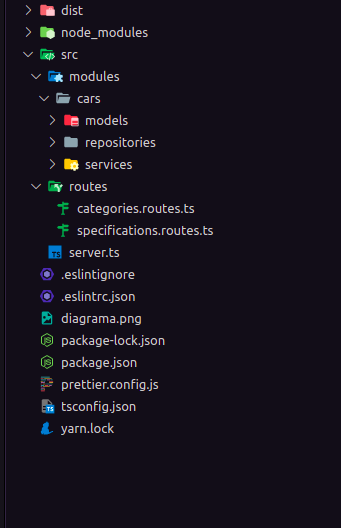  

## Use cases
Os Use cases são as funcionalidades do nosso projeto, como listar algo ou criar algo  

Vamos diminuir a carga dos nossos arquivos de rota que atualmente estão assim:

```javascript
import { Router } from "express";

import { SpecificationsRepositories } from "../modules/cars/repositories/SpecificationsRepositories";
import { CreateSpecificationService } from "../modules/cars/services/CreateSpecificationService";

const specificationsRoutes = Router();
const specificationsRepositories = new SpecificationsRepositories();
const newSpecification = new CreateSpecificationService(
  specificationsRepositories
);

specificationsRoutes.post("/specifications", (request, response) => {
  try {
    const { name, description } = request.body;
    newSpecification.execute({ name, description });
    return response.status(201).json({ message: "Specification created" });
  } catch (error) {
    return response.status(400).json({ error: error.message });
  }
});
specificationsRoutes.get("/specifications", (request, response) => {
  try {
    const specifications = specificationsRepositories.list();
    return response.json(specifications);
  } catch (error) {
    return response.status(400).json({ error: error.message });
  }
});

export { specificationsRoutes };

```
Agora as nossas rotas vão receber a requisição e enviar uma resposta sem precisar chamar classes e funções, vamos deixá-las como deixamos no MVC. Para isso vamos utilizar os use cases.  

Os use cases são dividos basicamente em 3 partes:  
Controllers  
UseCases  
Index  
Onde o UseCase faz o papel que era do service de executar a função, o controller faz o papel da rota de request e response e o index faz a instância de tudo:

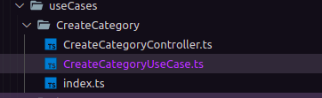  
Criado o use case para criar uma categoria, agora iremos fazer o mesmo para lista uma categoria:  
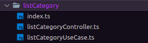  
A seguir estarão os esquemas de código de cada arquivo do useCase:  
UseCase do createCategory  
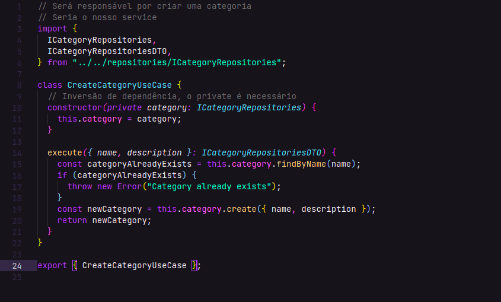  
Controller do createCategory  
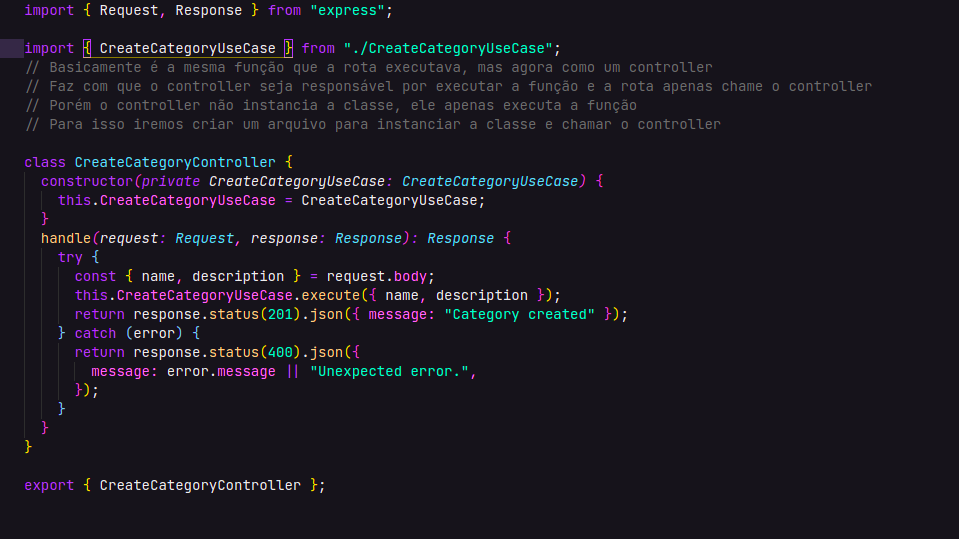  
Index do createCategory  
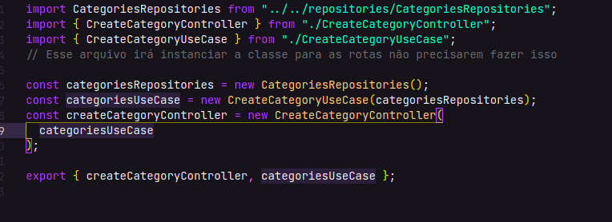   
Então esse é o esquema do nosso createCategory e do nosso listCategory, perceba que o index faz a instância das classes.  
Porém se cada pasta tem um index e o index faz uma instância, então temos 2 instâncias diferentes.  
Isso significa que a categoria que será criada no createCategory estará em uma instância diferente do listCategory, ou seja, o listCategory continuará vazio.  
Então como resolvemos esse problema de instâncias diferentes? Utilizaremos o Singleton Pattern.
## Singleton Pattern
**O Singleton especifica que apenas uma instância da classe pode existir, e esta será utilizada por toda a aplicação. Dessa forma temos apenas um ponto de acesso central a esta instância da classe.**  
O Singleton Pattern reduz o consumo de memória, porém não devemos utilizá-lo sempre, apenas em situações que sejam necessárias, como:  
- Quando você precisar controlar a concorrência de acesso a recursos compartilhados;
- Quando uma classe for utilizada com frequência por várias partes distintas do sistema, e essa classe não gerencia nenhum estado da aplicação;  
  
Principalmente quando iremos utilizar recursos compartilhados da mesma classe, como no exemplo dos use cases.  
Então iremos alterar o nosso CategoryRepository:  

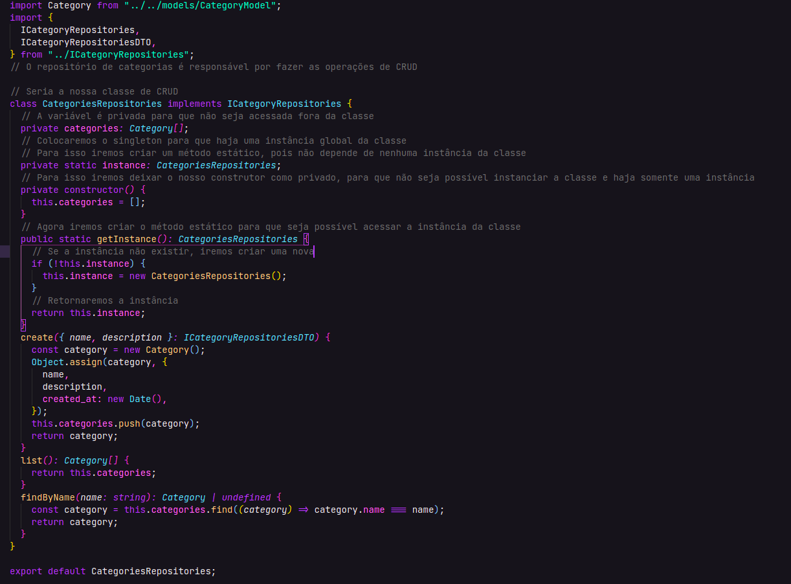  
e o nosso index agora será:

```js
import CategoriesRepositories from "../../repositories/implementations/CategoriesRepositories";
import { ListCategoryController } from "./listCategoryController";
import { ListCategoryUseCase } from "./listCategoryUseCase";

const listCategoryRepository = CategoriesRepositories.getInstance();
const listCategoryUseCase = new ListCategoryUseCase(listCategoryRepository);
const listCategoryController = new ListCategoryController(listCategoryUseCase);
export { listCategoryUseCase, listCategoryController };
```

Agora iremos somente dividir os nossos repositórios e iremos colocar as implementações separadas das interfaces, para isso iremos criar uma pasta somente para as implementações:  
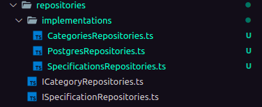  
E agora iremos migrar as nossas especificações para os useCases e portanto iremos excluir os serviços, modificar o repositório e refatorar as rotas, o mesmo que fizemos com as categorias.
## Documentação da API
**É extremamente importante uma boa documentação para uma API!!**  
Sabendo disso, tem algumas ferramentas que auxiliam na hora de fazer uma documentação, uma delas é a que iremos utilizar: Swagger.  
Para utilizar o swagger iremos instalar o pacote dele no projeto: yarn add swagger-ui-express  e para o typescript iremos fazer yarn add @types/swagger-ui-express -D  
Para utilizar ele iremos importá-lo no nosso server.ts:  

```javascript
import express from "express";
import swaggerUi from "swagger-ui-express";
import swaggerfile from "./swagger.json"

import categoriesRoutes from "./routes/categories.routes";
import { specificationsRoutes } from "./routes/specifications.routes";

const app = express();
app.use(express.json());
// Url to swagger documentation
app.use("/api-docs", swaggerUi.serve, swaggerUi.setup(swaggerFIle));
app.use(categoriesRoutes);
app.use(specificationsRoutes);
app.listen(3000, () => console.log("listening on 3000"));

```

Iremos usá-lo e definir uma rota onde ficará a nossa documentação, o nosso servidor  o iremos passar no setup um arquivo json que criamos na raiz da pasta src.  
Para funcionar iremos adicionar o resolveJsonModule no tsconfig.json para ele aceitar .json.  
No arquivo swagger.json iremos adicionar a seguinte configuração  

```json
{
  "openapi": "3.0.0",
  "info": {
    "title": "CarRent Documentation",
    "description": "CarRent API documentation",
    "version": "1.0.0"
  }
}
```

E na nossa rota api-docs terá:  
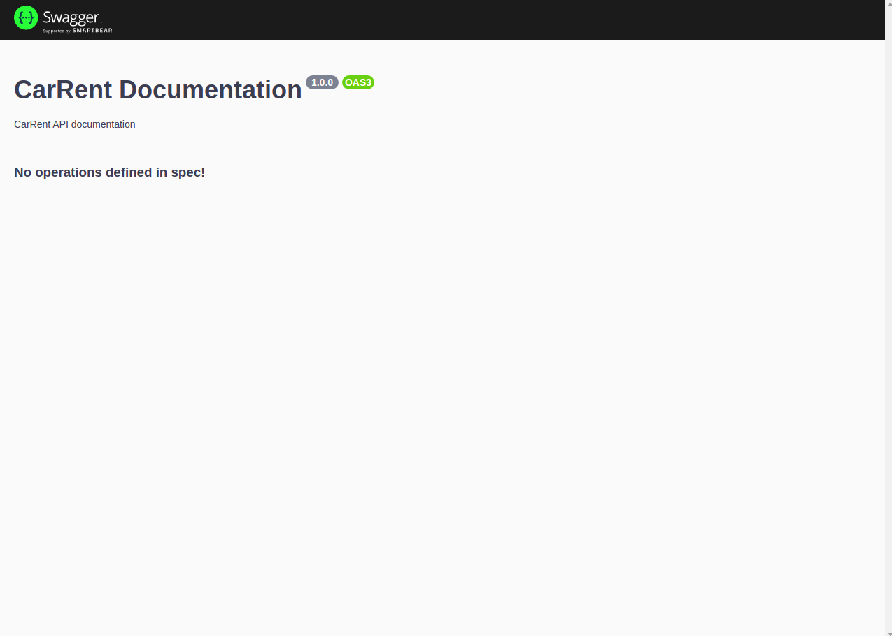  
As informações estão no github!