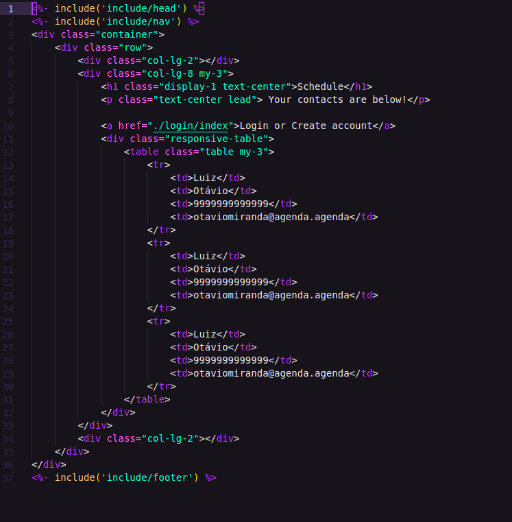

# Schedule Project
## Description
This project is for implement a Schedule with NODEJS and Express, the front end is from bootstrap site. The view engine is the ejs engine and the database is the MongoDB.  
The design pattern used is the MVC pattern, have another folder (Middleware) for the globals middlewares.
## Header and Footer
All the pages have the same header and footer layout, so was created a include folder to save the header and footer files and all the pages include that files.   
The HTML and CSS layout are a copy from bootstrap site. 
## Index.ejs
The index.ejs is the home page, we enable the webpack to add a css styles at the bundle.js file, but at now we disable that.  
At now our index.ejs is like: 

We have too a nav file to add a nav bar with the home link.  
For more front-end information go to the project.
## Login and Register
We create a login controller and model to the login/index route, at the login controller we create a middleware to render the login page when the user GET the page.  
We created the login page and that page is for send the data to the database, for that we create a forms and a post method.  
Com o método POST criado nas rotas criamos o middleware register no loginController e então esse register irá fazer o cadastro do usuário. No model fizemos o modelo de como será o cadastro e terá nele um e-mail e uma senha para realizar o cadastro e o login do usuário:

```javascript
    const loginSchema = new mongoose.Schema({
  //Modelando os dados
  //O email e a senha são do tipo string e são necessários
  email: {
    type: "string",
    required: true,
    unique: true,
  },
  password: {
    type: "string",
    required: true,
  },
});
const loginModel = mongoose.model("Login", loginSchema);
```

É especificado que o e-mail é único e que a senha e o e-mail são necessários para realizar login e cadastro.  
Agora precisamos linkar o nosso model ao nosso controller de login, para isso iremos criar uma classe chamada de Login, nessa classe irá ter os métodos de registro e de login.  
A classe terá como construtor o body:

```javascript
constructor(body) {
    this.body = body;
    //Criando um array de erros
    this.errors = [];
    //Criando um usuário começando como nulo
    this.user = null;
  }
```

Além de ter o body no construtor tem também um array de erros para armazenar os possíveis erros que venham a ocorrer e com isso será verificado sempre antes de iniciar uma nova ação no model e terá um usuário para armazenar o e-mail e a senha da instância e com ele também será verificado se o usuário já existe.  
O body é necessário, pois o método POST é acessado pela corpo da requisição: req.body, então na instância da classe o parâmetro passado será o req.body para que possar ser acessado os métodos de cadastro e de login:

```javascript
try{
    const login = new Login(req.body);
    await login.register();
}
```

Lembrando que SEMPRE quando estamos tratanto de banco de dados é necessário usar funções assíncronas, então a função de cadastro e de login são ambas async.  
Quando o botão de criar conta for acionado(tem o método POST ) irá direcionar para a página login/register e com isso irá acionar o método de cadastro e o mesmo acontece para o login.  
### Register
A classe terá o método para validar se o e-mail é válido, ele é feito pelo pacote do npm validator e será feito uma limpa nos campos do body do construtor para que seja passado somente strings para serem validadas.  

```javascript
valida() {
    this.cleanUp();
    //O e-mail precisa ser válido e a senha precisa ter no minimo 8 caracters e máximo de 30
    //Não queremos passar o método valida no controller, então iremos criar um método register para fazer esse método
    //Iremos instalar um pacote para verificar se o e-mail é valido: pacote validator
    //Iremos verificar se o email é valido, caso não seja iremos adicionar um erro ao nosso array de erros
    if (!validator.isEmail(this.body.email)) {
      this.errors.push("Invalid e-mail ");
    }
    //Vamos checar a senha
    if (this.body.password.length < 8 || this.body.password > 30) {
      this.errors.push(
        "Invalid password, needs to have between 8 and 30 characters"
      );
    }
  }
  //Criaremos o método cleanUp para confirmar que tudo que está para ser validade é uma string
  cleanUp() {
    //Iremos verificar cada chave do nosso body
    //O nosso body é os corpos do formulário
    for (const key in this.body) {
      if (typeof this.body[key] !== "string") {
        //Se em algum dos campos do nosso body não for identificado uma string iremos tratar como uma string vazia
        this.body[key] = "";
      }
    }
    //Aqui embaixo iremos garantir que só temos os campos enviados pelo nosso formulário, no caso aqui o e-mail e a senha
    //Iremos por exemplo impedir que o csrf seja lido
    //Garantimos que o objeto só tem os campos do model
    this.body = {
      email: this.body.email,
      password: this.body.password,
    };
  }
```

Iremos criar um método para verificar se o usuário já existe, para isso utilizaremos o método findOne do loginModel, **LEMBRANDO QUE SEMPRE QUE ALGO ESTÁ RELACIONADO AO BANCO DE DADOS PRECISAMOS ADICIONAR O ASYNC AWAIT**, portanto:

```javascript
async userExists() {
    this.user = await loginModel.findOne({ email: this.body.email });
    if (this.user) this.errors.push("User already exists");
  }
```

Iremos agora adicionar o método valida(que contém o método cleanUp sendo chamado dentro dele) e iremos verificar caso tenha algum erro dentro do nosso array de erros, nas funções sempre tem a verificação se tem erros e caso tenha é adicionado ao array. Estaremos sempre verificando se tem algum erro:

```javascript
async register() {
    this.valida();
    //Verificando se tem algum erro no array de erros, caso tenha o cadastro não será realizado
    if (this.errors.length > 0) return;
    try {
      //Fazendo o hash da senha
      const salt = bcryptjs.genSaltSync();
      this.body.password = bcryptjs.hashSync(this.body.password, salt);
      await this.userExists();
    } catch (error) {
      console.log(error);
    }
    if (this.errors.length > 0) return;
    //Caso passe do if precisamos registrar o usuário na base de dados
    //Sempre que fizermos operações com base de dados precisamos usar promisses, para isso então iremos adicionar o async await
    //Iremos enviar assim, pois já fizemos a limpeza do objeto com o cleanUp
    //Iremos preencher o user com o usuário passados nos campos do formulário
    try {
      this.user = await loginModel.create(this.body);
    } catch (error) {
      return;
    }
  }
```

Caso não haja nenhum erro na senha ou no e-mail iremos verificar se o usuário já existe, caso não existe iremos enviar a a senha em forma de hash para o body.password, após isso iremos adicionar usuário com o e-mail e senha ao banco de dados então ele estará cadastrado.
## Mensagens de erro ou sucesso
Instalamos o pacote de flash messages então iremos utilizar junto com as sessões para jogar na tela as messagens de erro ou de sucesso, temos a nossa pasta de middllewares e lá temos um middleware global, nele iremos adicionar o seguinte código:

```javascript
exports.middlewareGlobal = (req, res, next) => {
  //Todas as páginas terão os errors das flash messages
  //Capturamos os erros e injetamos nas páginas caso eles existam
  res.locals.errors = req.flash("errors");
  //Faremos o mesmo com as mensagens de sucesso
  res.locals.success = req.flash("success");
  //Não tirar a função next(), pois o server não rodará
  next();
};
```

Com isso ativamos no nosso servidor as flash messages e já habilitamos no server.js com o app.use(flash()) iremos utilizar as flash messages e as sessões para enviar mensagens de sucesso ou erro no cadastro e login, para isso incluimos nas nossas paginas ejs o include :

```javascript
<div class="row">
    <div class="col my-3">
        <div class="alert alert-danger">
            <% errors.forEach(erro => { %>
            <%= erro %> <br>
            <% }); %>
        </div>
    </div>
</div>
<% } %>
<% if (success.length > 0) { %>
<div class="row">
    <div class="col my-3">
        <div class="alert alert-success">
            <% success.forEach(suc => { %>
            <%= suc %> <br>
            <% }); %>
        </div>
    </div>
</div>
<% } %>
```

Com isso iremos adicionar essas mensagens caso estejam disponíveis, **LEMBRANDO QUE SESSÕES SERVEM PARA SALVAR DADOS DOS USUÁRIO NO LADO DO SERVIDOR QUE FICA IDENTIFICÁVEL NO NAVEGADOR DO USUÁRIO**    
<br>
<br>
<br>
**Em resumo, o navegador nos informa "quem ele é", se existir uma session salva na base de dados com os dados desse navegador, nosso sistema responde de volta com os dados dessa session. No seu caso, são as flash messages, mas poderia ser qualquer outra coisa.**

```javascript
 try {
    //Agora iremos passar o body da instancia, com isso poderemos modelar os dados
    if (login.errors.length > 0) {
      //Iremo exibir como um flash as mensagens de erro
      req.flash("errors", login.errors);
      //Iremos salvar a sessão e depos retornar para a paǵina de login
      req.session.save(function () {
        //Redirecionar para a pagina de onde o formulário veio
        //Iremos mostrar na tela as mensagens
        //Iremos retornar para finalizar e redirecionar
        return res.redirect("back");
      });
      return;
    }
    req.flash("success", "User create");
    req.session.save(function () {
      return res.redirect("back");
    });
  } catch (err) {
    console.log(err);
    //Iremos retornar para finalizar e renderizar
    return res.render("404");
  }
```

Adicionei a funcionalidade de verificar quantas vezes o navegador acessou a página desde que o servidor foi iniciado:

```javascript
homecontroller.js
exports.homePage = (req, res, next) => {
  if (req.session.page_views) {
    req.session.page_views++;
    req.flash("info", `Visitou a página ${req.session.page_views} vezes`);
    req.session.save(function () {});
  } else {
    req.session.page_views = 1;
    req.flash("info", "Bem vindo pela primeira vez");
  }
  res.render("index");
};
```

```javascript
index.ejs   
<%- include('include/messages.ejs') %>
messages.ejs
<% if (info.length > 0) { %>
<div class="row">
    <div class="col my-3">
        <div class="alert alert-success">
            <% info.forEach(suc => { %>
            <%= suc %> <br>
            <% }); %>
        </div>
    </div>
</div>
<% } %>
```