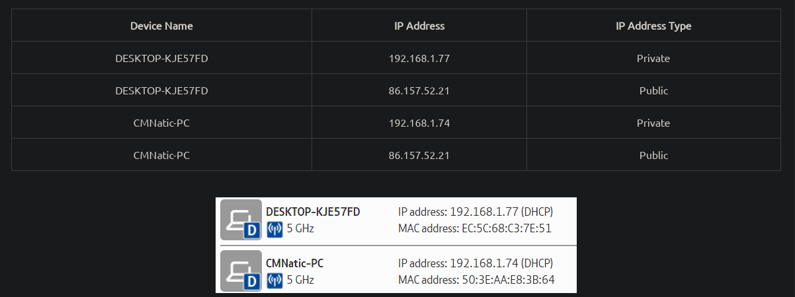

# _Cíber segurança_

## Capítulos

- Equipe Red Vs Blue Team
- Fundamentos da rede

## Red Team vs Blue Team

A equipe vermelha é a equipe ofensiva com um propósito: quebrar sistemas. Pode estar explorando bugs, abusando de etapas inseguras, aproveitando as políticas de controle de acesso não forçadas.
Somes tarefas:

- Invade sistemas e explique para a equipe o que está errado no sistema.

A equipe Blue é a equipe defensiva com duas tarefas: impedir intrusões e detectar intrusões quando elas ocorrem e respondendo corretamente.

- Consciência de segurança cibernética do usuário: o treinamento de usuários sobre segurança cibernética ajuda a proteger contra vários ataques que visam seus sistemas.
- Documentar e gerenciar ativos: precisamos conhecer os tipos de sistemas e dispositivos que precisamos gerenciar e proteger adequadamente.
- Atualizando e patching Sistemas: garantindo que computadores, servidores e dispositivos de rede sejam atualizados e corrigidos corretamente contra qualquer vulnerabilidade conhecida (fraqueza).
- Configuração de dispositivos de segurança preventiva: os sistemas de prevenção de firewall e intrusões (IPs) são componentes críticos da segurança preventiva. Os firewalls controlam qual tráfego de rede pode entrar e o que pode deixar o sistema ou a rede. O IPS bloqueia qualquer tráfego de rede que corresponda às regras e assinaturas de ataques.
- Configuração de dispositivos de registro e monitoramento: sem o log e o monitoramento adequados da rede, não será possível detectar atividades e intrusões maliciosas. Se um novo dispositivo não autorizado aparecer em nossa rede, devemos saber.

### Equipa vermelha

A equipe vermelha é a equipe ofensiva com um propósito: quebrar sistemas. Pode estar explorando bugs, abusando de etapas inseguras, aproveitando as políticas de controle de acesso não forçadas.
Os papéis da equipe vermelha são (alguns deles):

- Testador de penetração: responsável pela teste de tecnologia e sistemas para encontrar vulnerabilidades e fraquezas.
- Engenheiro de segurança: responsável por projetar e implementar soluções de segurança.
- Red Teamer (Hacker): Responsável por encontrar vulnerabilidades e fraquezas em sistemas e tecnologia em toda a empresa.

### Time azul

A equipe Blue é a equipe defensiva com duas tarefas: impedir intrusões e detectar intrusões quando elas ocorrem e respondendo corretamente.
Os papéis da equipe azul são (alguns deles):

- Analista do SOC: Responsável por monitorar e analisar eventos e alertas de segurança.
- Analista de inteligência de ameaças: Responsável por pesquisar e analisar ameaças e ataques cibernéticos.
- Analista de Forense Digital: Responsável por investigar e analisar evidências digitais.
- Analista de resposta a incidentes: Responsável por investigar e responder a incidentes de segurança.
- Analista de malware: responsável por analisar e malware de engenharia reversa.

## Fundamentos da rede

### O que é uma rede?

A rede é basicamente um grupo de coisas conectadas, como seus amigos e familiares, e como a Internet. Na computação, a rede é um grupo de computadores conectados.

### O que é a Internet?

A Internet é uma rede de redes. É uma rede global de computadores que estão conectados através de uma rede de outras redes menores, regionais e locais.
As redes pequenas são chamadas de redes privadas, onde as redes são conectadas juntas pela Internet, são chamadas de redes públicas.
Para se comunicar e manter a ordem, os dispositivos devem ser identificados e identificáveis ​​em uma rede.
Temos que maneiras de identificar dispositivos em uma rede:

- Endereço de IP
- Endereço MAC (Media Access Control) -> Como um número de série

### Endereço de IP

O endereço IP (Internet Protocol) é um endereço exclusivo que identifica um dispositivo em uma rede. Um endereço IP é um número de 32 bits que é dividido em quatro octetos. Cada octeto é um número entre 0 e 255. Esse número é calculado através de uma técnica conhecida como endereçamento e sub -rede IP, vamos ver isso no futuro.
Um endereço público é usado para identificar o dispositivo na Internet, enquanto um endereço privado é usado para identificar um dispositivo entre outros dispositivos. Dispositivos podem estar em uma rede pública e privada ao mesmo tempo. Por exemplo, um computador pode ser conectado a uma rede privada em casa e também estar conectado à Internet ao mesmo tempo. Tipo isso: 
