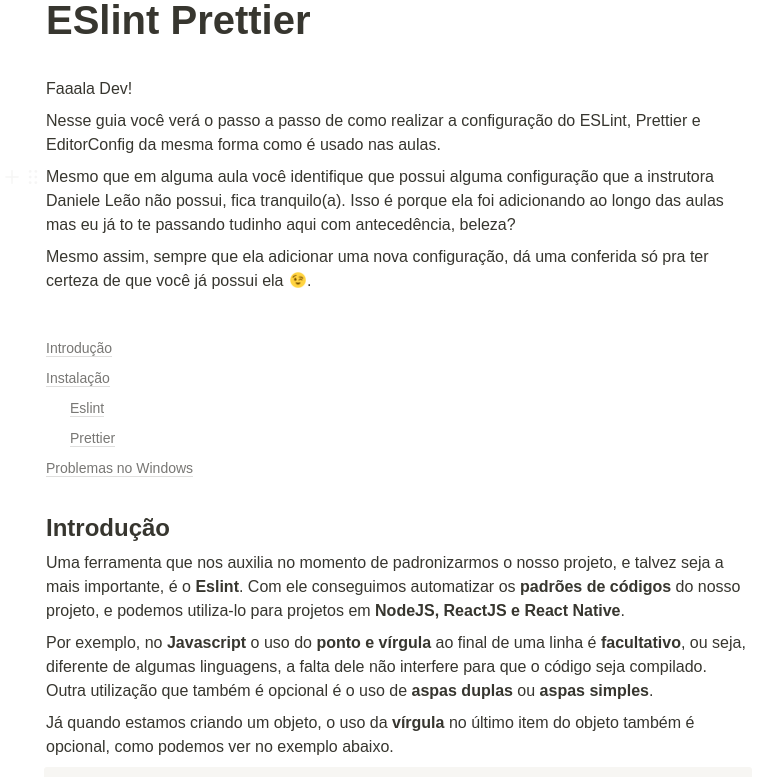
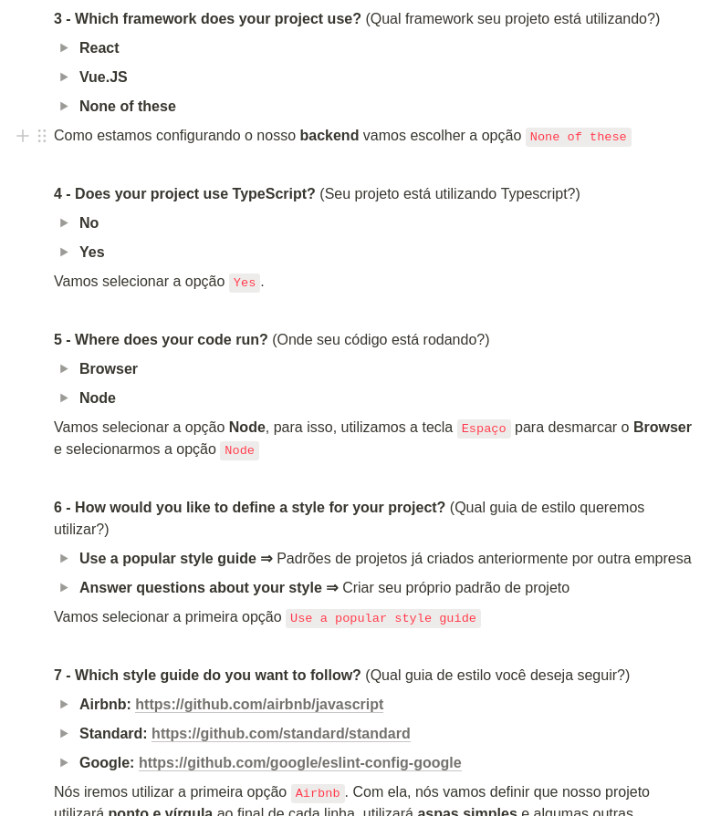
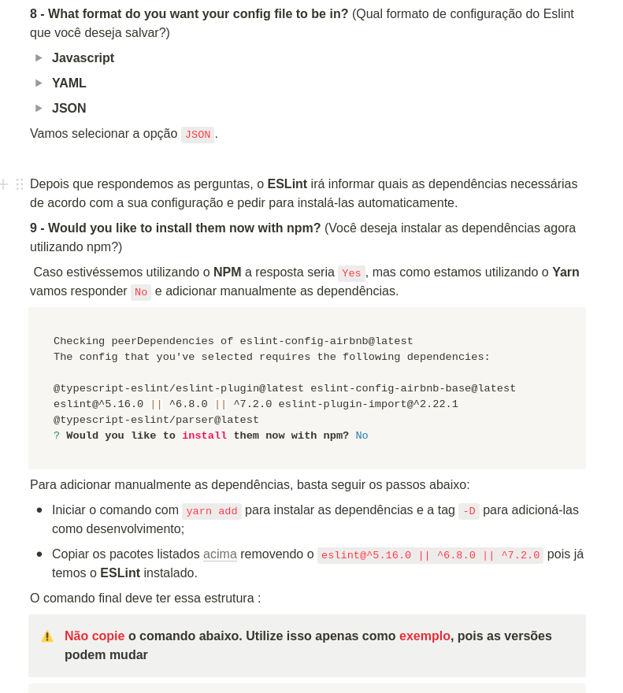
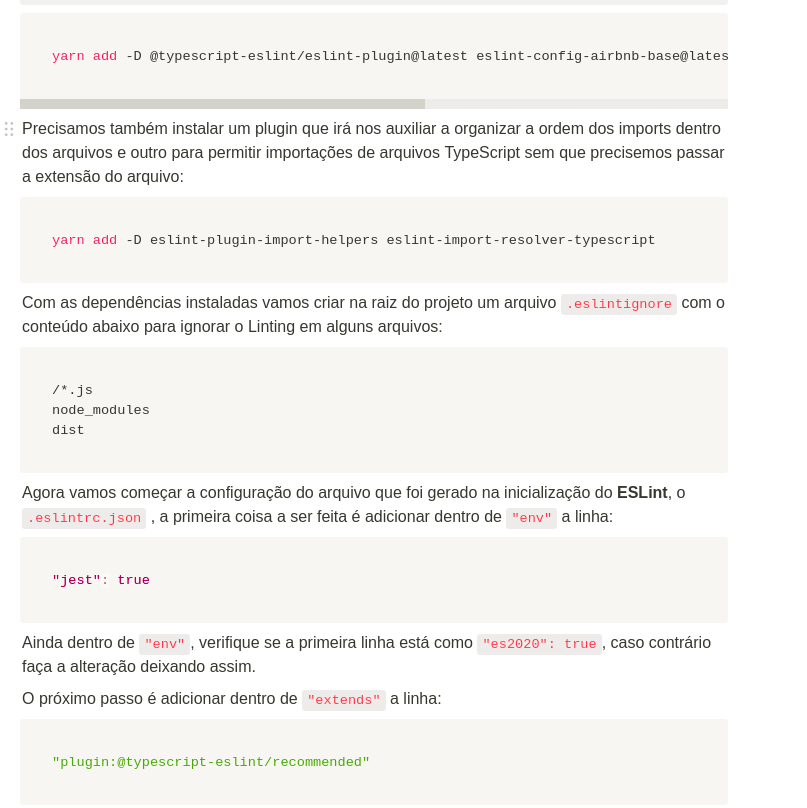
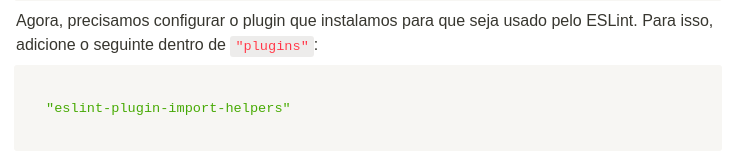
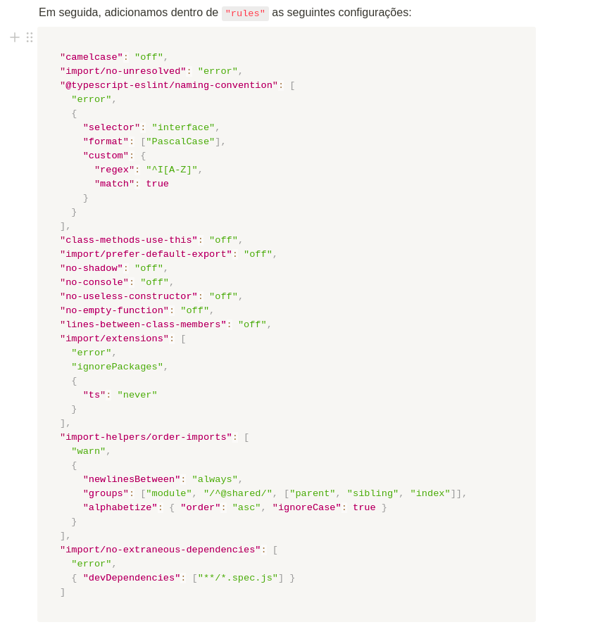
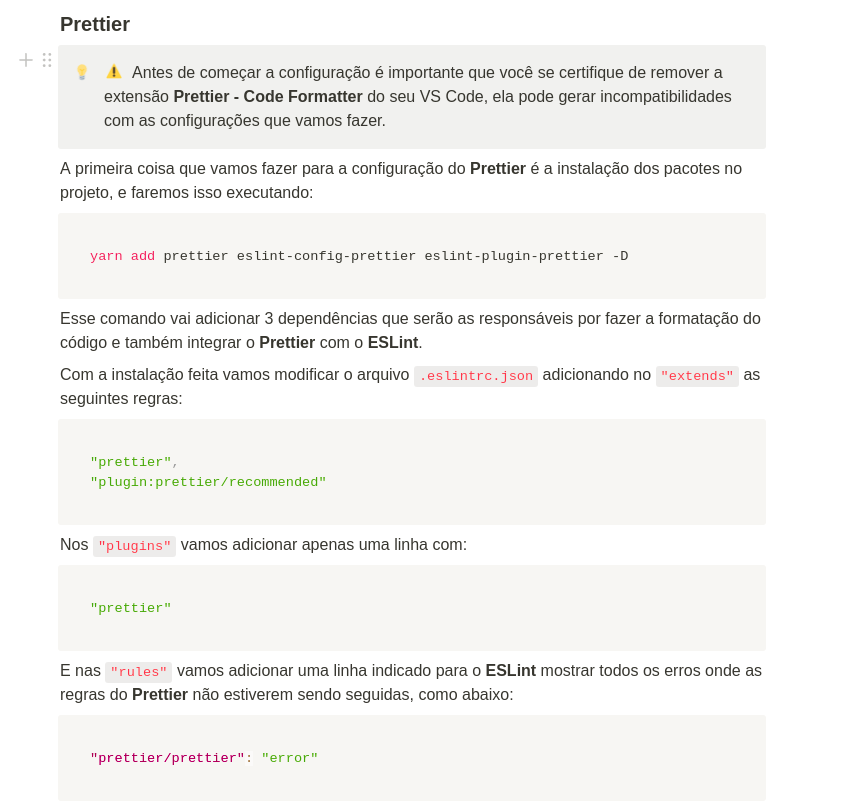

# Typescript
## O que é?
Typescript é um superset do javascript que permite tipar as variáveis.
## Como instalar
Antes de tudo precisamos instalar as libs do express e de outros frameworks para aceitar o ts, então fazemos: yarn add @types/express -D  
Precisaremos instalar o typescript e o ts-node-dev com o yarn  
## Rodar
    Para rodar o código iremos instalar o typescript e o ts-node, após isso iremos inicializar com o comando tsc —init. Então iremos alterar o tsconfig.json para que ele não crie os arquivos js com os arquivos ts. Alteramos o "outDir": "./" para "outDir": "./dist"
## Transpilar
Para transformar o arquivo em js, precisamos executar o comando: yarn tsc que irá criar um arquivo .js  

## Eslint Prettier
  
Instalar Eslint no vscode  


  
yarn add -D @typescript-eslint/eslint-plugin@latest eslint-config-airbnb-base@latest eslint-plugin-import@latest @typescript-eslint/parser@latest  

```json

{
    "env": {
      "es2021": true,
      "node": true,
      "jest": true
    },
    "extends": [
      "airbnb-base",
      "plugin:@typescript-eslint/recommended",
      "prettier",
      "plugin:prettier/recommended"
    ],
    "parser": "@typescript-eslint/parser",
    "plugins": ["@typescript-eslint", "eslint-plugin-import-helpers", "prettier"],
    "parserOptions": {
      "ecmaVersion": 13,
      "sourceType": "module"
    },
    "rules": {
      "camelcase": "off",
      "import/no-unresolved": "error",
      "@typescript-eslint/naming-convention": [
        "error",
        {
          "selector": "interface",
          "format": ["PascalCase"],
          "custom": {
            "regex": "^I[A-Z]",
            "match": true
          }
        }
      ],
      "class-methods-use-this": "off",
      "import/prefer-default-export": "off",
      "no-shadow": "off",
      "no-console": "off",
      "no-useless-constructor": "off",
      "no-empty-function": "off",
      "lines-between-class-members": "off",
      "import/extensions": [
        "error",
        "ignorePackages",
        {
          "ts": "never"
        }
      ],
      "import-helpers/order-imports": [
        "warn",
        {
          "newlinesBetween": "always",
          "groups": ["module", "/^@shared/", ["parent", "sibling", "index"]],
          "alphabetize": { "order": "asc", "ignoreCase": true }
        }
      ],
      "import/no-extraneous-dependencies": [
        "error",
        { "devDependencies": ["**/*.spec.js"] }
      ],
      "prettier/prettier": "error"
    },
    "settings": {
      "import/resolver": {
        "typescript": {}
      }
    }
  }
  

```

```json
package.json

"scripts": {
    "dev": "ts-node-dev --respawn src/server.ts --inspect --transpile-only --ignore-watch node_modules"
  },
  "dependencies": {
    "express": "^4.17.1"
  },
  "devDependencies": {
    "@types/express": "^4.17.13",
    "@typescript-eslint/eslint-plugin": "^5.3.0",
    "@typescript-eslint/parser": "^5.3.0",
    "eslint": "^8.1.0",
    "eslint-config-airbnb-base": "^14.2.1",
    "eslint-config-prettier": "^8.3.0",
    "eslint-import-resolver-typescript": "^2.5.0",
    "eslint-plugin-import": "^2.25.2",
    "eslint-plugin-import-helpers": "^1.1.0",
    "eslint-plugin-prettier": "^4.0.0",
    "prettier": "^2.4.1",
    "prettier-eslint": "^13.0.0",
    "ts-node-dev": "^1.1.8",
    "typescript": "^4.4.4"
  }
```







## Watch server
Agora para não precisarmos ficar rodando o yarn tsc, iremos instalar o ts-node-dev para desenvolvimento e futuramente para produção  
Dentro do nosso package.json, vamos adicionar o script para rodar o ts-node-dev  
"dev": "ts-node-dev --inspect --transpile-only --ignore-watch node_modules --respawn src/server.ts"  
Para rodar o ts-node-dev, precisamos executar o comando: yarn dev  
A flag --respawn é para que o ts-node-dev rode novamente quando o arquivo for alterado  
A flag --inspect é para que seja possível o debug, junto com a configuração do debug com o type: node e request: attach no launch.json  
A flag --ignore-watch é para que o ts-node-dev ignore as alterações no arquivo node_modules  
Iremos acessar o tsconfig.json para alterar o strict para false, pois o typescript já está configurado para alertar quando houver erros  
## Iniciando o Projeto
Para iniciar o projeto iremos criar o nosso server.ts e configurá-lo de forma padrão:
```javascript
Server.ts
// É possível fazer import assim com o ts
import express from "express";

import routes from "./routes";

const app = express();
app.use(express.json());
app.use(routes);
app.listen(3333);
```
**No Typescript é possível importar e exportar da maneira padrão do javascript até mesmo para o node, por isso precisamos instalar as dependencias também para o typescript.**  
Agora iremos criar o nosso arquivo de rotas:
```javascript
Routes.ts
import express, { Request, Response } from "express";

import CreateCourseService from "./createCourseService";

const router = express.Router();

router.get("/", (request: Request, response: Response) => {
  const Service = new CreateCourseService();
  Service.execute({ name: "NodeJS", educator: "Dani", duration: 10 });
  Service.execute({ name: "ReactJS", educator: "Diego" });
  return response.json({ message: "Hello World" });
});
router.post("/courses", (request: Request, response: Response) => {
  const { name } = request.body;
  return response.json({ name });
});

export default router;
```

Pelo fato do typescript ser tipado iremos adicionar os tipos das variáveis request e response que no próprio express estão definidadas como Request e Response  

Vendo agora o arquivo createCourseService:
```javascript
createCourseService.ts
// Facilita na hora de criar um curso e deixar algo como opcional
interface ICourse {
  name: string;
  educator: string;
  duration?: number;
}

class CreateCourseService {
  // Colocando a duração padrão de 8 semanas
  execute({ name, educator, duration = 8 }: ICourse) {
    console.log(`Creating course ${name}`);
    console.log(`Duration: ${duration}`);
    console.log(`Educator: ${educator}`);
  }
}
export default CreateCourseService;
```

Esse é o nosso código e contém uma Interface, pois não estamos ainda trabalhando com banco de dados então estamos deixando o nosso request.body livre e para isso podemos passar em qualquer ordem os nossos campos, inclusive deixá-los como opcional.