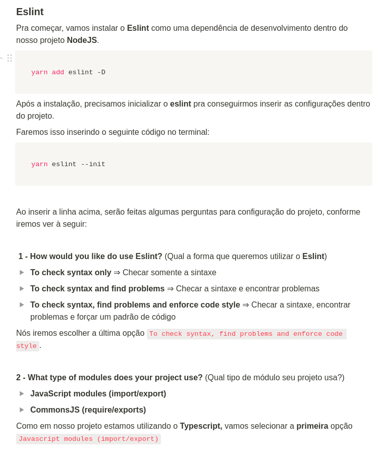
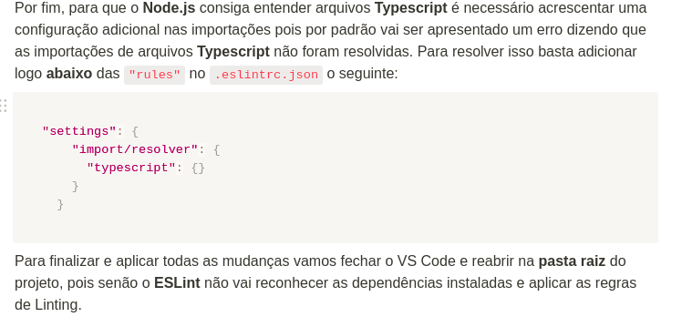

# Typescript
## O que é?
Typescript é um superset do javascript que permite tipar as variáveis.
## Como instalar
Antes de tudo precisamos instalar as libs do express e de outros frameworks para aceitar o ts, então fazemos: yarn add @types/express -D  
Precisaremos instalar o typescript e o ts-node com o yarn  
## Rodar
    Para rodar o código iremos instalar o typescript e o ts-node, após isso iremos inicializar com o comando tsc —init. Então iremos alterar o tsconfig.json para que ele não crie os arquivos js com os arquivos ts. Alteramos o "outDir": "./" para "outDir": "./dist"
## Transpilar
Para transformar o arquivo em js, precisamos executar o comando: yarn tsc que irá criar um arquivo .js  

## Eslint Prettier

Instalar Eslint no vscode

## Watch server
Agora para não precisarmos ficar rodando o yarn tsc, iremos instalar o ts-node-dev para desenvolvimento e futuramente para produção  
Dentro do nosso package.json, vamos adicionar o script para rodar o ts-node-dev  
"dev": "ts-node-dev --transpile-only --ignore-watch node_modules --respawn src/server.ts"  
Para rodar o ts-node-dev, precisamos executar o comando: yarn dev  
A flag --respawn é para que o ts-node-dev rode novamente quando o arquivo for alterado  
A flag --ignore-watch é para que o ts-node-dev ignore as alterações no arquivo node_modules  
Iremos acessar o tsconfig.json para alterar o strict para false, pois o typescript já está configurado para alertar quando houver erros  